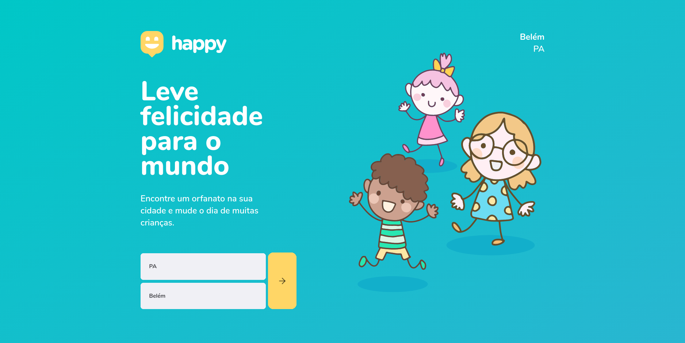

<h1 align="center">
    
</h1>

  

## 🚀 Tecnologias

Esse projeto foi desenvolvido com as seguintes tecnologias:

- [Node.js](https://nodejs.org/en/)
- [React](https://reactjs.org)
- [React Native](https://facebook.github.io/react-native/)
- [Expo](https://expo.io/)
- [TypeScript](https://www.typescriptlang.org/)

## 💻 Projeto

O Happy é uma aplicação que conecta pessoas à casas de acolhimento institucional para fazer o dia de muitas crianças mais feliz 💜

## 🚀️ Funcionalidades adicionadas 

- Implementação da API do IBGE na web e mobile, desabilitando o botão para navegar para proxima página enquanto o estado e cidade não estão selecionados  
- Implementação do campo `whatsapp` na api criada com NodeJS, e integrando com o link direto para o app do Whatsapp no número cadastrado no orfanato
- Buscar a localização atual do usuário com a lib `$ expo location`

Feito com 💛️ por luccaroli 
